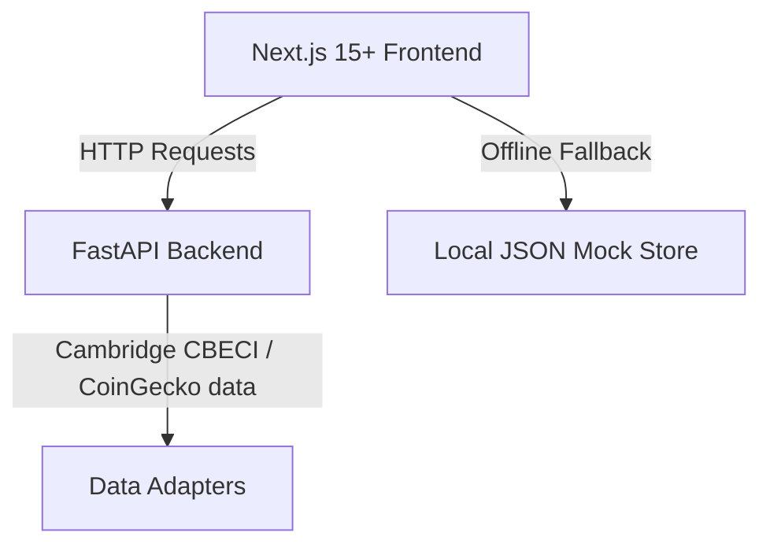
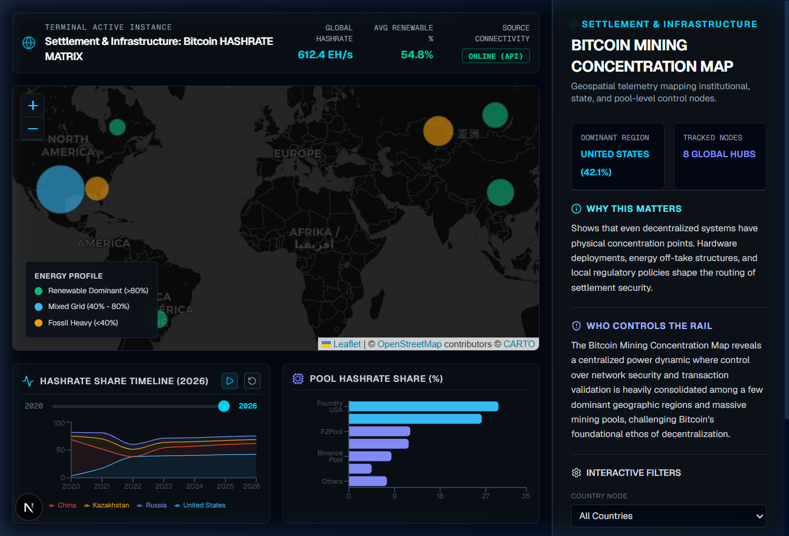
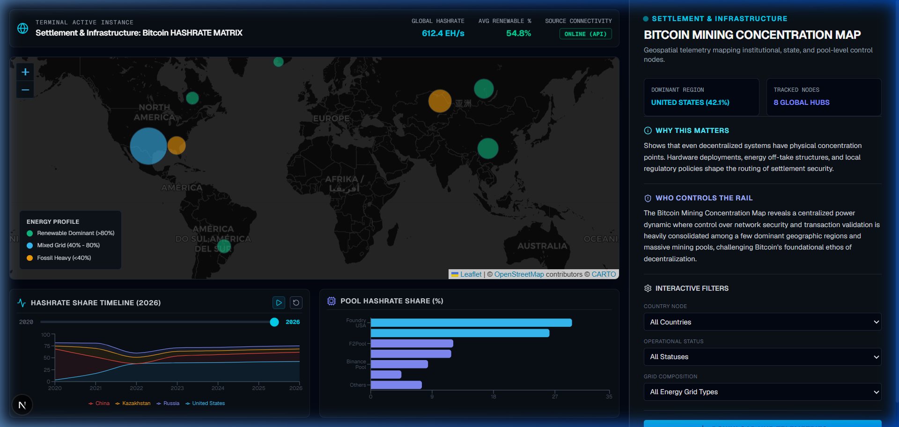
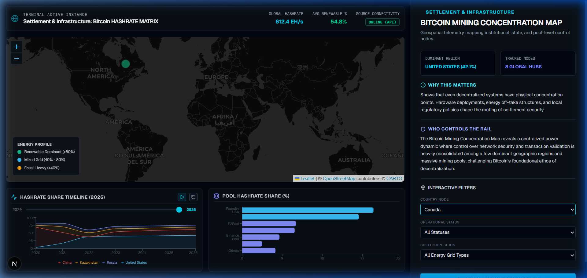

# Bitcoin Mining Concentration Map

A real-time analytics terminal and interactive geospatial dashboard designed for the Real Rails Intelligence Library. It visualizes settlement infrastructure security metrics, regional energy mix data, mining pool concentrations, and historical geographic hashrate migration.

---

## 📋 Table of Contents
- [Project Overview](#-project-overview)
- [Demo Video](#-demo-video)
- [Architecture](#-architecture)
- [Setup & Installation](#-setup--installation)
- [Screenshots](#-screenshots)
- [UAT & Verification](#-uat--verification)

---

## 🎥 Demo Video

A walkthrough video demonstrating the features of the Bitcoin Mining Concentration Map is available in the repository:
- **[Watch Demo Video](./docs/demo.mp4)**

---

## 🔍 Project Overview

The Bitcoin Mining Concentration Map is a dual-pane analytical dashboard built to trace the geographic distribution and institutional control of the Bitcoin network's computing power (hashrate). 

### Key Features:
- **Interactive Leaflet Map**: Overlays colored circular markers corresponding to regional power grids. Marker size scales dynamically to hashrate share, colored by grid composition.
- **Geographic Migration Timeline (2020-2026)**: Time-series replay widget built with Recharts Area component showing the shifts after China's 2021 hashrate ban and subsequent migration.
- **Mining Pool Share Analysis**: Renders top mining pools (Foundry USA, AntPool, F2Pool, etc.) to highlight institutional centralization.
- **Offline Resilient Mode**: Automatically falls back to local structured datasets if the FastAPI server is offline, switching the HUD state to `OFFLINE (LOCAL MOCK)`.
- **CSV Data Export**: Direct download of regional datasets containing complete coordinates, hashrate split, and energy context data.

---

## 🛠️ Architecture

The project is split into a Python FastAPI backend and a Next.js frontend:



### 1. Python FastAPI Backend (`/backend`)
- **FastAPI Framework**: High performance API serving endpoint requests.
- **Endpoints**:
  - `/api/summary`: Key metrics like global network hashrate and average green energy index.
  - `/api/map-data`: GeoJSON output mapping coordinates of major global hubs.
  - `/api/historical`: Monthly timelines (2020-2026) capturing the global migration of hashrate.
  - `/api/pools`: Distribution of hashrate across dominant pools.
  - `/api/download`: Stream-download endpoint generating CSV extracts of regional datasets.

### 2. Next.js 15+ Frontend (`/frontend`)
- **React-Leaflet**: Geospatial rendering of global mining hubs.
- **Recharts**: Responsive timeline and pool share charts.
- **Tailwind CSS**: Strict adherence to the Real Rails Design DNA (Obsidian Black `#030712`, Deep Navy `#0B1117`, Borders `#1F2937`, Accent Cyan `#38BDF8`).
- **TypeScript**: Clean, type-safe development.

---

## 🚀 Setup & Installation

### Backend Setup
1. Navigate to the backend directory:
   ```bash
   cd backend
   ```
2. Create and activate a Python virtual environment:
   ```bash
   python -m venv venv
   # On Windows
   .\venv\Scripts\activate
   # On macOS/Linux
   source venv/bin/activate
   ```
3. Install dependencies:
   ```bash
   pip install -r requirements.txt
   ```
4. Start the server:
   ```bash
   uvicorn main:app --reload --port 8000
   ```

### Frontend Setup
1. Navigate to the frontend directory:
   ```bash
   cd frontend
   ```
2. Install dependencies:
   ```bash
   npm install
   ```
3. Run the development server:
   ```bash
   npm run dev
   ```
4. Open [http://localhost:3000](http://localhost:3000) in your browser to view the application.

---

## 📸 Screenshots

### 1. Dashboard Interface


### 2. Analytics Charts & Timeline Replay


### 3. Interactive Filters


---

## 🧪 UAT & Verification

- For detailed compliance, see **[VAR_REPORT.md](./VAR_REPORT.md)**.
- For functional checklist verification, see **[UAT_CHECKLIST.md](./UAT_CHECKLIST.md)**.
